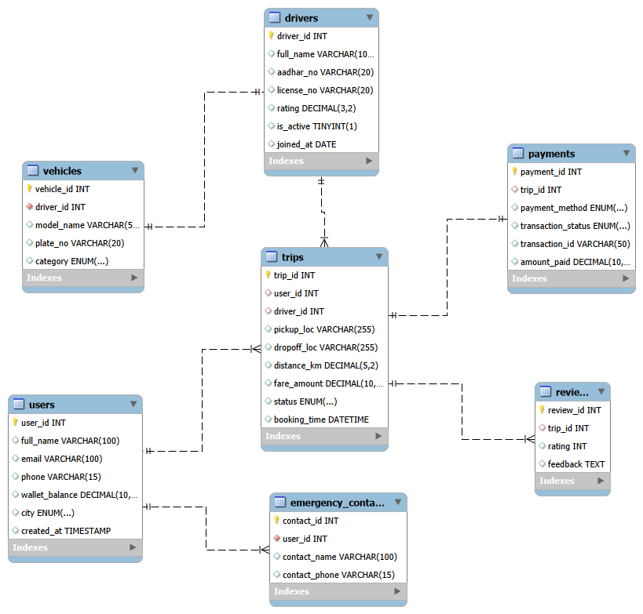

**Indian Uber Management System**  
Relational Database Project (MySQL)  

📌**Project Overview** 

The Indian Uber Management System is a relational database project designed to simulate a real-world ride-booking platform like Uber in India.

**This system efficiently manages:**

👤 Users (Passengers)

🚗 Drivers

🚙 Vehicles

🛣️ Trips

💳 Payments

⭐ Reviews

🚨 Emergency Contacts

The project focuses on database normalization, entity relationships, and real-world ride-booking workflow implementation.

🏗️ **Database Architecture**

The system consists of 7 main tables with properly defined Primary Keys and Foreign Key relationships.
  

1️⃣ 👤 **Users Table**

Stores passenger details.

<table border="1" cellpadding="10" cellspacing="0">
    <tr>
        <th>Column Name</th>
        <th>Data Type</th>
        <th>Description</th>
    </tr>
    <tr>
        <td>user_id</td>
        <td>INT (PK)</td>
        <td>Unique User ID</td>
    </tr>
    <tr>
        <td>full_name</td>
        <td>VARCHAR(100)</td>
        <td>User Full Name</td>
    </tr>
    <tr>
        <td>email</td>
        <td>VARCHAR(100)</td>
        <td>User Email Address</td>
    </tr>
    <tr>
        <td>phone</td>
        <td>VARCHAR(15)</td>
        <td>User Mobile Number</td>
    </tr>
    <tr>
        <td>wallet_balance</td>
        <td>DECIMAL(10,2)</td>
        <td>Available Wallet Balance</td>
    </tr>
    <tr>
        <td>city</td>
        <td>ENUM</td>
        <td>User City</td>
    </tr>
    <tr>
        <td>created_at</td>
        <td>TIMESTAMP</td>
        <td>Account Creation Time</td>
    </tr>
</table>

2️⃣ 🚗 **Drivers Table**

Stores driver registration and verification details.

<table border="1" cellpadding="10" cellspacing="0">
    <tr>
        <th>Column Name</th>
        <th>Data Type</th>
        <th>Description</th>
    </tr>
    <tr>
        <td>driver_id</td>
        <td>INT (PK)</td>
        <td>Unique Driver ID</td>
    </tr>
    <tr>
        <td>full_name</td>
        <td>VARCHAR(100)</td>
        <td>Driver Name</td>
    </tr>
    <tr>
        <td>aadhar_no</td>
        <td>VARCHAR(20)</td>
        <td>Aadhaar Number</td>
    </tr>
    <tr>
        <td>license_no</td>
        <td>VARCHAR(20)</td>
        <td>Driving License Number</td>
    </tr>
    <tr>
        <td>rating</td>
        <td>DECIMAL(3,2)</td>
        <td>Driver Rating</td>
    </tr>
    <tr>
        <td>is_active</td>
        <td>TINYINT(1)</td>
        <td>Driver Active Status</td>
    </tr>
    <tr>
        <td>joined_at</td>
        <td>DATE</td>
        <td>Joining Date</td>
    </tr>
</table>

3️⃣ 🚙 **Vehicles Table**

Each driver is assigned one vehicle.

<table>
        <tr>
            <th>Column Name</th>
            <th>Data Type</th>
            <th>Description</th>
        </tr>
        <tr><td>vehicle_id</td><td>INT (PK)</td><td>Unique Vehicle ID</td></tr>
        <tr><td>driver_id</td><td>INT (FK)</td><td>Linked Driver ID</td></tr>
        <tr><td>model_name</td><td>VARCHAR(50)</td><td>Vehicle Model</td></tr>
        <tr><td>plate_no</td><td>VARCHAR(20)</td><td>Registration Number</td></tr>
        <tr><td>category</td><td>ENUM</td><td>UberGo / UberPremier / UberAuto / UberXL </td></tr>
    </table>
    
4️⃣ 🛣️ **Trips Table (Core Table)**

Manages ride bookings.
<table>
        <tr>
            <th>Column Name</th>
            <th>Data Type</th>
            <th>Description</th>
        </tr>
        <tr><td>trip_id</td><td>INT (PK)</td><td>Unique Trip ID</td></tr>
        <tr><td>user_id</td><td>INT (FK)</td><td>Passenger ID</td></tr>
        <tr><td>driver_id</td><td>INT (FK)</td><td>Driver ID</td></tr>
        <tr><td>pickup_loc</td><td>VARCHAR(100)</td><td>Pickup Location</td></tr>
        <tr><td>dropoff_loc</td><td>VARCHAR(100)</td><td>Drop Location</td></tr>
        <tr><td>distance_km</td><td>DECIMAL(5,2)</td><td>Trip Distance</td></tr>
        <tr><td>fare_amount</td><td>DECIMAL(10,2)</td><td>Total Fare</td></tr>
        <tr><td>status</td><td>ENUM</td><td> Completed / Cancelled</td></tr>
        <tr><td>booking_time</td><td>DATETIME</td><td>Trip Booking Time</td></tr>
    </table>

5️⃣ 💳 **Payments Table**

Stores transaction details.

<table>
        <tr>
            <th>Column Name</th>
            <th>Data Type</th>
            <th>Description</th>
        </tr>
        <tr><td>payment_id</td><td>INT (PK)</td><td>Payment ID</td></tr>
        <tr><td>trip_id</td><td>INT (FK)</td><td>Linked Trip ID</td></tr>
        <tr><td>payment_method</td><td>ENUM</td><td> UPI / Cash / PayTM / AmazonPay / Credit_Card</td></tr>
        <tr><td>transaction_status</td><td>ENUM</td><td>Success / Failed </td></tr>
        <tr><td>transaction_id</td><td>VARCHAR(50)</td><td>Transaction Reference</td></tr>
        <tr><td>amount_paid</td><td>DECIMAL(10,2)</td><td>Paid Amount</td></tr>
    </table>
    
6️⃣ ⭐ **Reviews Table**

Stores user ratings and feedback.
 <table>
        <tr>
            <th>Column Name</th>
            <th>Data Type</th>
            <th>Description</th>
        </tr>
        <tr><td>review_id</td><td>INT (PK)</td><td>Review ID</td></tr>
        <tr><td>trip_id</td><td>INT (FK)</td><td>Linked Trip ID</td></tr>
        <tr><td>rating</td><td>INT</td><td>Rating (1–5)</td></tr>
        <tr><td>feedback</td><td>TEXT</td><td>User Feedback</td></tr>
    </table>

7️⃣ 🚨 **Emergency Contacts Table**

Stores emergency contact details for users.

<table>
        <tr>
            <th>Column Name</th>
            <th>Data Type</th>
            <th>Description</th>
        </tr>
        <tr><td>contact_id</td><td>INT (PK)</td><td>Contact ID</td></tr>
        <tr><td>user_id</td><td>INT (FK)</td><td>Linked User ID</td></tr>
        <tr><td>contact_name</td><td>VARCHAR(100)</td><td>Emergency Contact Name</td></tr>
        <tr><td>contact_phone</td><td>VARCHAR(15)</td><td>Emergency Contact Number</td></tr>
    </table>

🔗 **Entity Relationships**

One **User** ➝ Many **Trips**  
One **Driver** ➝ Many **Trips**  
One **Driver** ➝ One **Vehicle**  
One **Trip** ➝ One **Payment**  
One **Trip** ➝ One **Review**  
One **User** ➝ **Many Emergency Contacts**  

⚙️ **Key Features**

✔ User registration & wallet management  
✔ Driver onboarding with Aadhaar & License verification  
✔ Vehicle assignment to drivers  
✔ Ride booking system  
✔ Distance-based fare calculation  
✔ Multiple payment options   
✔ Trip status tracking  
✔ Driver rating & feedback system  
✔ Emergency contact support  
✔ Transaction monitoring  

📊 **Business Rules Implemented**
<ul>
<li>Only active drivers can accept trips </li>  
<li>Payment allowed only for completed trips</li> 
<li>Reviews can be submitted only after trip completion</li>   
<li>Wallet balance auto-deducted when wallet payment selected</li>  
<li>One driver is assigned only one vehicle</li>  
</ul>

🛠️ **Technologies Used**

MySQL  
SQL (DDL & DML)  
ER Modeling   
Database Normalization   
Relational Database Concepts  

🧠 **System Workflow**

User registers
Driver registers & vehicle assigned
User books a ride
Driver accepts trip
Trip gets completed
Payment processed
User submits rating & review

 
 
📷 **ER Diagram**

 

🎯 **Project Objective**

To design and implement a normalized and scalable relational database system for a ride-booking platform in India that ensures data integrity, efficient relationships, and smooth ride lifecycle management.

 

👨‍💻 **Author**

Vipul Alsundkar
Data & BI Enthusiast
